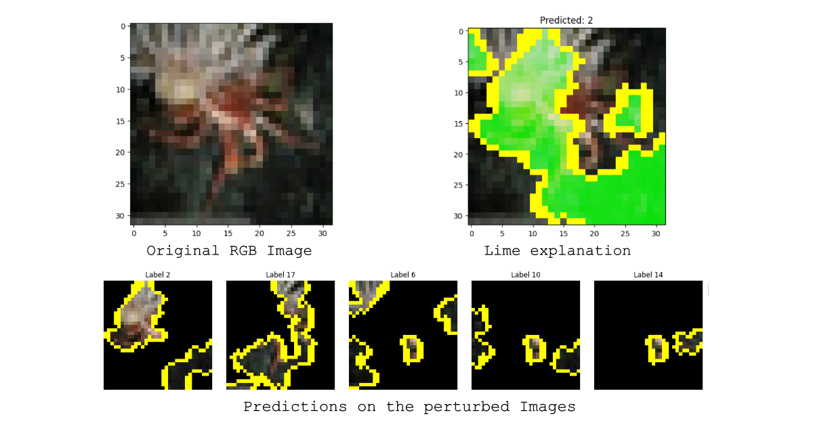
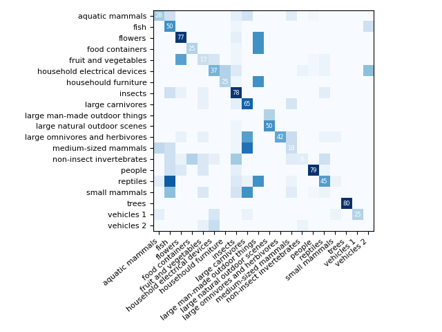
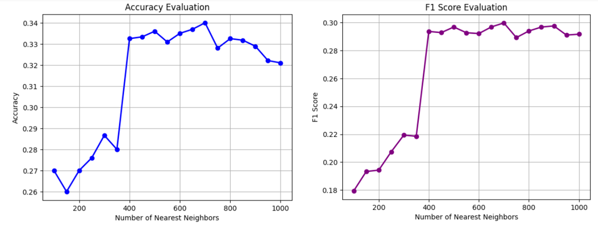
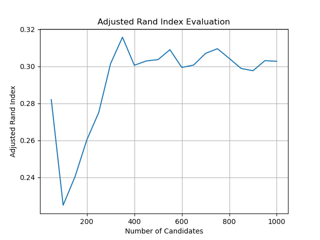
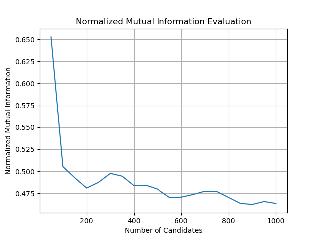
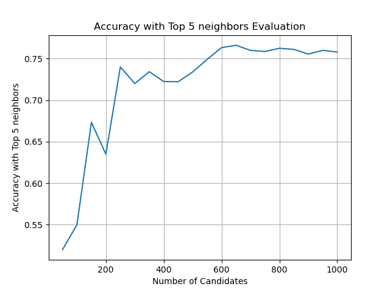

# Clustering of Images using SCAN with Visual Explainations

## Contents
1. [Objective](#objective)
0. [Installation](#installation)
0. [Training](#training)
0. [Steps to execute](#Steps-to-execute)
0. [Results](#results)

## Objective
To cluster images from a dataset using SCAN with visual explanations. Refer to the Reference Paper for detailed information.

## Installation
The code runs with recent Pytorch versions, e.g. 2.0.1. 
The most important packages can be installed as:
```shell
conda install pytorch torchvision torchaudio pytorch-cuda=11.7 -c pytorch -c nvidia
conda install matplotlib scipy scikit-learn   # For evaluation and confusion matrix visualization
conda install faiss-gpu                       # For efficient nearest neighbors search 
conda install pyyaml easydict                 # For using config files
conda install termcolor                       # For colored print statements
conda install -c conda-forge grad-cam         # For visual explainations
```
We refer to the `requirements.txt` file for an overview of the packages in the environment we used to produce our results.

## Training
We have trained the SCAN model over the standard CIFAR100-20 image training dataset and persisted that model into the repository at `repository_eccv\cifar-20\scan\model.pth.tar`<br>
Similarly, we have refined the model using self-labeling and persisted that model at `repository_eccv\cifar-20\selflabel\model.pth.tar`

SCAN was imported from [here](https://github.com/wvangansbeke/Unsupervised-Classification)<br>
The SCAN README file can be found [here](SCAN_README.md)<br>

### Execution Steps
STEP 1: Use K-nearest neighbors to find candidate images for each image with find_k_nearest_neighbours.py.
STEP 2: Cluster the candidate images using the model with Cluster_img.py.
STEP 3: Display evaluation charts with eval_charts.py.

For example, run the following commands to perform our method on CIFAR20:
```shell
python find_candidates.py --config_env configs/env.yml --config_exp configs/pretext/simclr_cifar20.yml
python app.py --n 300 --query 500 --config_exp configs/scan/scan_cifar20.yml --model repository_eccv/cifar-20/scan/model.pth.tar
python eval_charts.py --query 500 --config_exp configs/scan/scan_cifar20.yml --model repository_eccv/cifar-20/scan/model.pth.tar
```

To apply LIME on the clustered dataset, add the --visualize_prototypes flag as follows:
```shell
python Lime.py --n 300 --query 500 --config_exp configs/scan/scan_cifar20.yml --model repository_eccv/cifar-20/scan/model.pth.tar --visualize_prototypes

```
It will show prototype image of each cluster and it's respective heatmap. In the heatmap, you can see what were the most coontributing features for that cluster.

<p align="center">
    
    
</p>

<p align="center">
    
</p>

### Results
The confusion matrix is generated as follows:
<p align="center">
    
</p>

After evaluating clustering for dynamic number of candidate images [50, 100,...,1000], we got clustering performance metrics as follows:
1. Accuracy
2. Adjusted Rand Index
3. Normalized Mutual Information
4. Accuracy with Top 5 neighbors

And the charts we generated are as follows:
<p align="center">
    
    
    
    
</p>


